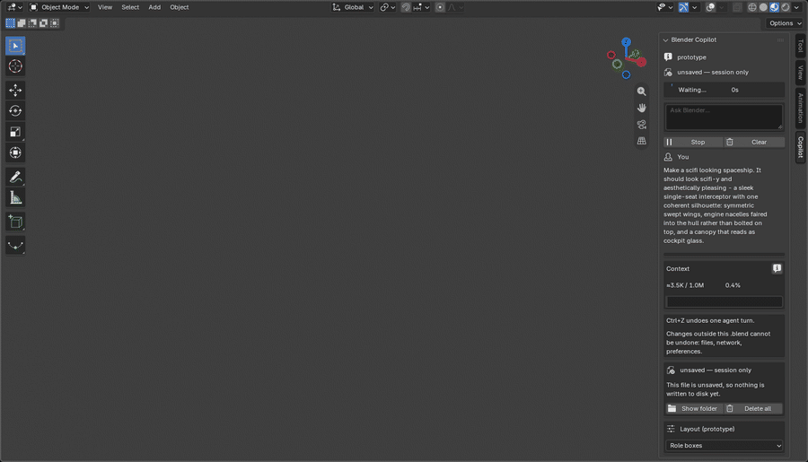
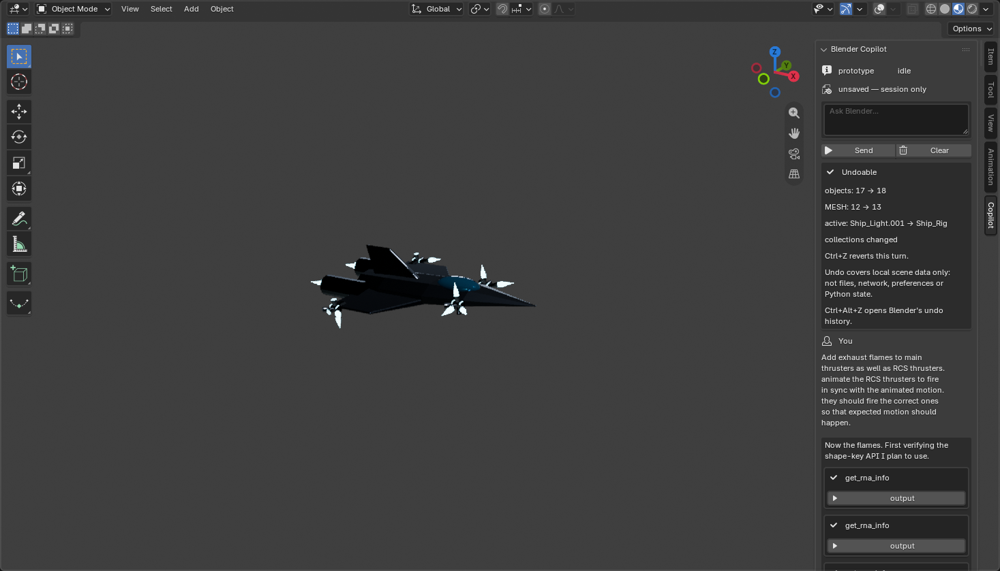
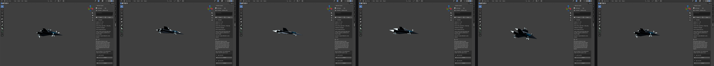
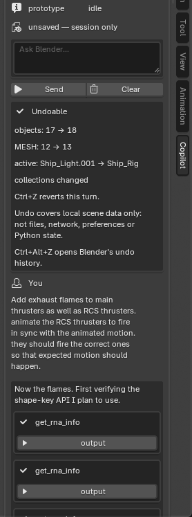
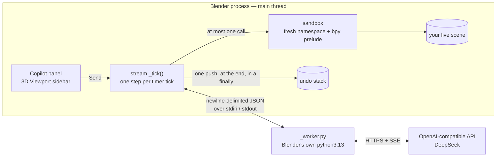
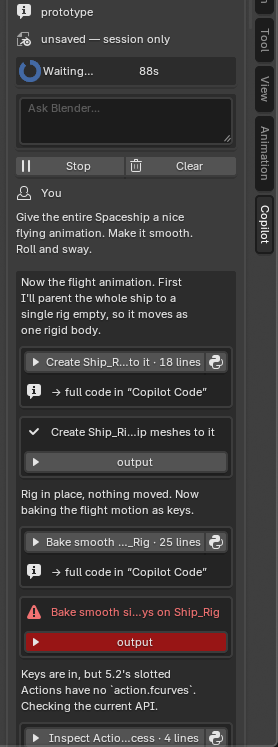
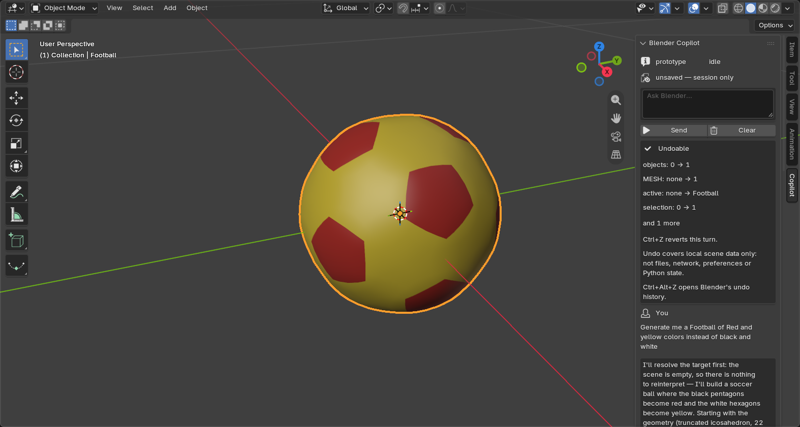

<div align="center">

# Blender Copilot

**Five sentences in. A spaceship out.**

A Copilot-style chat panel that lives *inside* Blender. It runs an agent loop in
Blender's own Python process, executes the model's `bpy` against your live scene, and
wraps the whole turn in **one Ctrl+Z**.

No bridge. No sidecar. No second copy of your scene to keep in sync — the loop *is*
Blender's Python, so `bpy.context` is live and correct by construction.




<sub>**Five prompts, one spaceship — recorded from a real Blender 5.2.2 session against
a real model.** The panel, the loop, the sandbox that runs the model's code, the
transcript rows and the undo receipt are the shipped add-on; the code is the model's.
The GIF is the build, cut to 18 s; the flight is played at the end of the
[video below](#five-sentences-one-spaceship), because a GIF cannot hold motion and an
animation that is never played looks exactly like no animation at all.</sub>

</div>

---

### Why it is different, in three lines

- 🧬 **The agent runs *inside* Blender, not beside it.** Same process, same
  `bpy.context`, same selection, same mode, same undo stack. Nothing needs mirroring
  because nothing is on the other side.
- ↩️ **One turn = one undo step.** `Ctrl+Z` takes back every call the turn made — and
  the receipt beside the transcript states what that step does *not* cover. Measured
  both ways, including the case where pushing early makes undo reach too far.
- 🔬 **The results that lost are published.** A capability guard that a 77-attempt probe
  showed does *not* contain was therefore **not built**. Most numbers below are the
  numbers that killed a design.

<sub>Star it if you want to see where this goes — and read
[what it does not do](#what-it-does-not-do) before you point it at a real file.</sub>

---

## Five sentences, one spaceship

Sent one after another, as a conversation. Each prompt is a *step*, not a
specification — the third only means anything against the object the second one
built.

| # | Prompt (verbatim) | What came back |
|---|---|---|
| 1 | Make a scifi looking spaceship. It should look scifi-y | A faceted stealth hull, swept wings and an integrated tail fin, nacelles with glow discs, a canopy, four materials, bevel modifiers — and its own hero camera, three lights and dark world. |
| 2 | Add RCS thrusters to get 6DoF flight | Four RCS pods carrying 24 nozzle bells, given their own materials, then a read-back of every nozzle's exhaust direction. |
| 3 | Make the RCS thrusters match the scifi look. And also position them properly. | It rebuilt the pods four times and **ray-cast every nozzle to prove the exhaust path was clear** — diagnosing a self-hit on the aft bells, canting the nozzles 35° outboard, moving the aft cassettes out to the wingtips, then re-verifying all 20. |
| 4 | Give the entire Spaceship a nice flying animation. Make it smooth. Roll and sway. | A `Ship_Rig` empty with all 12 meshes parented to it, baked sinusoidal roll and sway, then *"compare evaluated curve values against the exact sine per channel"* — plus pre-roll and post-roll keys to fix the tangent at the loop seam. |
| 5 | Add exhaust flames to main thrusters as well as RCS thrusters. animate the RCS thrusters to fire in sync with the animated motion. they should fire the correct ones so that expected motion should happen. | 22 plumes as a single mesh driven by **per-nozzle shape keys**, flame intensity baked to the ship's own accelerations, then the firing signs rechecked against a volume-based centre of mass. |

The video, in one file: the build at a readable pace, then **the animation played at
its own frame rate** — every frame the model keyframed, at 24 fps, at the end.

https://github.com/user-attachments/assets/517c3c50-036b-459a-ae45-2f910dcc7654

<div align="center">

</div>

<sub>The last frame at full size — a GIF is too small to see the detail and a video is
awkward to stop on the frame you want.</sub>

<div align="center">

</div>

<sub>The flight as stills, for anyone who looks away during a loop.</sub>

| Measured, from that run | |
|---|---|
| Wall clock, all five turns | **917 s** (15 min) |
| Model calls | **52**, of which **4** were read-only `get_rna_info` lookups before it touched anything |
| Provider usage | **109,016** prompt tokens — **106,880 of them cached** — 1,236 completion, 739 of those reasoning |
| The last turn's receipt | `objects: 17 → 18`, `MESH: 12 → 13` — the flame rig, added as one step |

### What the harness stages, and what it does not

Stated plainly, because a recording of an agent should say where the agent stops:

- It **empties Blender's default file** first (a Cube, a Camera and a Light — the cube
  sits exactly where a spaceship gets built), opens the sidebar, and re-frames the
  camera as geometry appears. The model's own *"switch 3D viewports to Rendered
  shading"* is what gives the picture its dark backdrop; the world and the lights are
  the model's, not the harness's.
- It **steps the timeline** to photograph the animation, one frame per tick, and the
  composer plays those frames back at the scene's rate. That is the harness pressing
  play, and nothing else.
- It **writes no scene code**. In this mode `tools/demo_capture.py` contributes no
  `bpy` at all — five sentences go in and the geometry comes back.

The playback rate is not a guess. The capture reads the scene's frame rate and this take
logged `scene fps: 24`, which is the number the composer used to time the flight — so the
rate the animation was authored at is the rate you see.

The previous take could not say that: it predates the capture logging the frame rate, so
its flight was timed off Blender's default 24 fps on faith. Same number, but one was
measured and one was assumed.

## The idea

Every Blender AI tool has to answer one question: how does the model's code reach your
scene? Most answer it with a bridge — a socket, a file mailbox, a Node sidecar, a
second process holding a copy of the scene that has to be kept in sync.

This one answers it with `exec`. The loop runs **in Blender's Python process**, so
`bpy.context` is live and correct by construction: the same objects, the same
selection, the same mode, the same undo stack. Nothing needs mirroring because nothing
is on the other side.

That choice has consequences, and the interesting part of this project is that most of
them were **measured rather than assumed** — see
[what is measured](#what-is-measured-not-claimed). Some are uncomfortable, and they are
written down anyway.

**Where this stands.** A working vertical slice inside a real Blender 5.2.2: the panel,
the loop, the three tools, per-turn undo, streaming, the context budget and per-`.blend`
history all run, and every picture here came out of an actual GUI session. It is **not**
published to the extensions platform yet. **There is no `LICENSE` file in this
repository**, so no terms have actually been chosen: the manifest's `license` key is a
value the extension platform *requires* to be present (removing it fails validation with
`missing "license"`), not a grant. Treat reuse as unlicensed until a real one lands.
What is missing is listed under
[what it does not do](#what-it-does-not-do) rather than left to be found.

## What it does

| | |
|---|---|
| **Panel** | The 3D Viewport sidebar, `N` → **Copilot**. Labelled user turns, one bordered box per assistant turn, tool rows with output behind an expander, errors as first-class blocks, and a busy indicator that only redraws while a turn is live. |
| **Agent loop** | Up to 8 rounds / 24 tool calls per turn (both are levers now), with a repeat-signature stop and a consecutive-failure stop. **One step per timer tick** — nothing can block the UI thread. |
| **Tools** | Three, deliberately: `run_blender_python` (fresh namespace per call, a required `purpose`, and the full traceback on failure), `get_scene_info` (counts and a bounded list — never a scene dump), `get_rna_info` (exact-name lookup against the live build, because a hand-maintained API list rots). |
| **Undo** | **One step per turn**, pushed at the end in a `finally`, labelled in Undo History. The receipt beside the transcript is a pre/post diff of the scene summary. |
| **Context** | A request-time projection of the conversation, measured in UTF-8 bytes against a 48,000-byte budget and **never written back** to the store. The live scene summary rides last as a second `system` message, so the base prompt keeps index 0 and the provider's cache prefix survives — 98% of those 109,016 prompt tokens were cache hits. |
| **History** | JSON outside the `.blend`, scoped per file path with an alias on Save-As. 200 messages / 1 MiB, pruned by whole turn. |
| **Streaming and Stop** | SSE from a subprocess; `Stop` replaces `Send` in the same slot, and the panel states exactly what Stop can and cannot interrupt. |

### The receipt, and the one Ctrl+Z

<div align="center">

</div>

A turn that changed the scene leaves one step in Undo History, named after the prompt.
One `Ctrl+Z` takes the whole turn back — every call in it, not the last one. The receipt
says what the step covers and, in the same box, what it does not: *local scene data
only, not files, network, preferences or Python state*. That sentence is not decoration;
it is the boundary the probes measured.

## How it works



Three decisions are load-bearing, and each was argued rather than assumed:

- **HTTP runs in a subprocess, not a thread.** Blender's own docs name the long-lived
  thread plus repeating timer as *unsupported*, and every shipped Blender download does
  HTTP in a process. Launch-to-ready measured at **0.021 s**, with IPC two orders of
  magnitude below one timer tick — the safe option was also the cheap one.
- **A tick does exactly one thing** — drain the reply, *or* execute one tool call, *or*
  finalize. Not tidiness: the tick that drains a reply carrying `tool_calls` is the tick
  that queues the rows, so executing in the same callback would run the code before the
  panel had ever drawn its `running…` row.
- **The push goes at the end.** Measured both ways — see below.

<div align="center">

</div>

<sub>Mid-turn: the indicator is running, reasoning is still arriving, and the tool row
names the call. Code never clutters the transcript — the panel shows an identity row and
mirrors the full text to an addon-owned `Copilot Code` datablock.</sub>

## Run it

Blender's Python ships `requests` and `certifi`, so there is nothing to `pip install`.
Target is a real Blender **5.2.x**; `blender_version_min` is pinned to `5.2.0`.

### Fast loop — symlink the package

```bash
EXT="$HOME/Library/Application Support/Blender/5.2/extensions/user_default"
mkdir -p "$EXT"
ln -sfn "$PWD/blender_copilot" "$EXT/blender_copilot"
```

Restart Blender, then enable **Blender Copilot** in *Preferences → Add-ons*. If
`user_default` is missing from *Preferences → Get Extensions → Repositories*, add a
local repository first.

### Real loop — build and install a package

```bash
mkdir -p dist     # the builder does not create this itself
/Applications/Blender.app/Contents/MacOS/Blender -c extension build \
    --source-dir ./blender_copilot --output-dir ./dist

/Applications/Blender.app/Contents/MacOS/Blender -c extension install-file \
    -r user_default -e ./dist/blender_copilot-0.0.1.zip
```

`-e` enables it on install. Add `validate` before `build` to check the manifest.

### Then

Open the 3D Viewport, press `N`, pick the **Copilot** tab, and type. Two things worth
knowing first:

- **The API key** goes in the add-on preferences (masked on screen, plaintext on disk —
  see [what it does not do](#what-it-does-not-do)), or in `DEEPSEEK_API_KEY` and
  `DEEPSEEK_API_URL` in the environment that launches Blender. Blender does not read a
  `.env` for you.
- **The model name is empty out of the box**, and falls back to `DEEPSEEK_MODEL`, then
  to `deepseek-flash`. Take a name from the provider's own docs: the legacy
  `deepseek-v4-flash` is still *accepted* and is silently remapped to a retired model,
  which is a concrete reason never to hard-code a string from memory.

## What is measured, not claimed

This is the part of the project worth your time. Every line came from a probe in
[`tools/`](tools/), and the numbers are the numbers the probe printed — including the
ones that killed a design.

| Claim | How it was settled |
|---|---|
| **Undo pushes at the end** | One push covers a whole multi-operation turn in a single Ctrl+Z. Pushing *before* the change reverts **further back than the change it was protecting** — so push-at-end survived the test designed to break it. |
| **An unpushed change is worse than unprotected** | Ctrl+Z reaches *past* it and deletes the object. |
| **Never push in edit mode** | A push there returns ok, records nothing usable, and the following undo **deletes the object being edited**. So the panel warns in edit mode rather than blocking Send, and refuses the push. |
| **Operators called from Python never push undo** | Measured — and the reason "just press Ctrl+Z" was never a real gate for arbitrary code. |
| **A blocking native call cannot be interrupted** | A 1 s alarm still let a `numpy` call run **5.34 s**, so the UI says so instead of promising otherwise. Pure-Python loops *can* be stopped: SIGALRM does it at **1.04×** overhead, where a `sys.monitoring` LINE hook cannot stop `while True: pass` at all. |
| **The capability guard is hygiene, not containment** | 77 attempts: **49 denied, 2 escaped**, 11 blocked by absence, 15 allowed. Both escapes go through introspection rather than any named path — two lines with no imports get out. |
| **The manifest's network permission is a declaration, not a sandbox** | Python sockets work from Blender with global online access off and `--offline-mode` set. |
| **A panel cannot scroll and has no rich text** | `UILayout.textbox()` is the only multi-line input in 5.2.2. Hence newest-turn-first, a bounded transcript, and a companion `Text` datablock for code and full history. |
| **The provider's wire contract** | A `tool_call` with **no matching `tool` result is rejected, HTTP 400** — so the loop's synthetic `cancelled` results are load-bearing. `function.arguments` arrives as a **JSON string, not an object**. A trailing `system` message is accepted, which is what keeps the cache prefix alive. |

<div align="center">

</div>

<sub>A different task, same panel, before this recording harness existed: one prompt,
three tool calls, a real receipt (`objects: 0 → 1`), and the provider's own token
counts. Kept here so the five-turn recording is not the only evidence.</sub>

## What it does not do

Published because a project that only lists its wins is not telling you anything. These
are consequences of ratified decisions, not oversights:

- **Model-authored code auto-runs, unscoped.** No approval gate, no capability
  restriction. A gate *was* proposed and **rejected** — on the strength of the guard's
  own probe, which showed it does not contain. A gate whose evidence says it does not
  gate buys false confidence, so the mechanism was not built. The starting point stands:
  the model's code runs in your Blender process, and `bpy.app.handlers` or
  `bpy.app.timers` can register work that outlives the turn.
- **The API key is plaintext** in `userpref.blend`, masked on screen only. `SKIP_SAVE`
  was verified *not* to keep it out of the file. Use the environment variable if you
  would rather it never land on disk.
- **Undo covers local `bpy.data` only** — not files, not subprocesses, not network, not
  preferences, not Python state.
- **Stop cannot reach a call that has not returned.** It kills the worker and the next
  turn, not the `numpy` call already inside the interpreter.
- **`blender -b` is out of scope by construction.** Timers and modal operators do not
  fire headless, and the loop is built on timers.
- **Turns are slow when the model thinks.** 15 minutes for the five above; the model
  spent most of it working, and thinking is on by default at the provider and billed as
  completion tokens. The byte budget and `Stop` exist for exactly that.

## Where the plan lives

The work is charted as a wayfinder map: **18 tickets, all resolved**, in
[`.scratch/blender-copilot/`](.scratch/blender-copilot/map.md) — each decision in exactly
one ticket, with the alternatives and their costs, plus a
[ratification record](docs/ratification.md) of the one point where a human ruled
(**15 accepted, 1 rejected** — the approval gate).

Read the map if you want to disagree with a decision: it states what was rejected and
why, which is the part that is usually missing.

## Project layout

```
blender_copilot/            the extension — 16 modules, ~9,600 lines
  panel.py                  the panel, its operators, its preferences
  conversation.py           transcript state, and the turn's state machine
  execution.py              the three tools: validation, caps, truncation
  transport.py  _worker.py  the subprocess, ndjson framing, SSE reassembly
  budget.py  context.py     what the next request costs, and the projection into it
  undo.py  undo_blender.py  the push discipline, and the receipt
  store.py  scope.py        history outside the .blend, scoped per file path
tests/                      4 suites, plain CPython, no Blender needed
tools/                      the probes, and the recording harness
docs/media/                 the pictures in this README
docs/ratification.md        the human's rulings
```

### Verify it yourself

```bash
# four suites, plain CPython
for t in tests/test_*.py; do python3 "$t" || echo "FAILED $t"; done

# the panel's draw body, headless, with a stub UILayout
/Applications/Blender.app/Contents/MacOS/Blender --background --factory-startup \
    --python tools/panel_draw_smoke.py

# record the five turns yourself (spends a few cents), then compose the media
set -a; . ./.env; set +a
DEMO_LIVE=1 DEMO_UI_SCALE=1.0 python3 tools/bounded_run.py 3600 -- \
    /Applications/Blender.app/Contents/MacOS/Blender \
    --window-geometry 20 20 1790 960 --python tools/demo_capture.py
python3 tools/demo_media.py

# or rebuild the same pictures with no key and no network
python3 tools/bounded_run.py 240 -- \
    /Applications/Blender.app/Contents/MacOS/Blender \
    --window-geometry 20 20 1790 960 --python tools/demo_capture.py
```

Blender exits **0 even when a `--python` script raises**, so every Blender-side check
prints a verdict token (`SMOKE OK`, `DEMO OK`, `MEDIA OK`) and the caller greps for the
token. Gate on the token, never on the exit status — that is measured, not assumed, and
it is the rule that keeps the probes honest.

<div align="center">
<sub>

Built by **XEonAX** · `bl_ext.user_default.blender_copilot` · **0.0.1**

**No licence chosen yet** — nothing here is licensed for reuse until one is.

⭐ Star it if it saves you time, and
[argue with a decision](.scratch/blender-copilot/map.md) if you think it is wrong —
the map states what was rejected and why, which is the part usually missing.

`#blender` `#bpy` `#aiagents` `#llm` `#deepseek` `#python` `#3d`

</sub>
</div>
